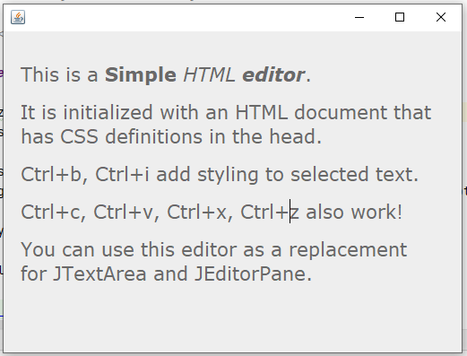

# About
Forked from: https://github.com/freeplane/shtml

Also take a look at: https://sourceforge.net/projects/simplyhtml/

# Maven

        <dependency>
            <groupId>io.github.geniot</groupId>
            <artifactId>shtml</artifactId>
            <version>1.0</version>
        </dependency>

# Differences

* Mavenized source code
* Added simple mode

How to use Simple Mode:
https://github.com/geniot/shtml/blob/master/src/test/java/io/github/geniot/shtmltest/ShtmlPanelTest.java

Basically I modified shtml constructors to accept `boolean isComponent`.

The result is a bare editor:

# This file contains

- About SimplyHTML
- Downloads
- Requirements
- Installation
- Usage
- Compilation
- License

# About SimplyHTML

  SimplyHTML is an application for text processing. It
  stores documents as HTML files in combination with
  Cascading Style Sheets (CSS).

  SimplyHTML is not intended to be used as an editor for
  web pages. The application combines text processing
  features as known from popular word processors with a
  simple and generic way of storing textual information
  and styles.

SimplyHTML readme file
Stage 13, May 24th, 2009

Copyright (c) 2002, 2003 Ulrich Hilger, 2008 Dimitri Polivaev
http://simplyhtml.sf.net/
(see 'License' below)

# Downloads

The SimplyHTML offers 3 packages you can download:
	- SimplyHTML_bin_<Version>.zip - this is the one you need!
	- SimplyHTML_manual_<Version>.zip - an HTML version of the help
	  (only for your convenience, the same help is available within
	  the application)
	- SimplyHTML_src_<Version>.tar.gz - the source code, if you don't
	  know what it is, you don't need it!

# Requirements

  To use SimplyHTML, you will need to have a Java JRE
  (Java Runtime Environment) installed, with a version equal or
  higher to 1.4.2.

  To compile and run the sources, a Java 2 Standard
  Edition 1.4 (J2SE) or higher Development Kit (JDK)
  is required.

  J2SE and/or JRE can be obtained at http://java.sun.com/javase/downloads/

# Installation

  Once you've downloaded the 'bin' and possibly the 'manual' zip
  files, extract them (keeping the directory structure) into a directory
  of your choice, e.g. "C:\Program Files\" or "/opt", a directory "SimplyHTML"
  will be created, with everything you need within it. In the below lines,
  we'll call this directory <SimplyHTMLDir>.
  
Note:
  Contents of the downloaded zip file can be restored
  by using one of the many applications capable to
  extract ZIP files. If you do not have such an
  application, you can use application Extractor
  available free at

      http://www.calcom.de/eng/product/xtract.htm

# Usage
  
  Starting SimplyHTML can be as easy as double-clicking on the
  file "<SimplyHTMLDir>/lib/SimplyHTML.jar".
  If it doesn't work, try to call the following from the command line:
  	Under Windows:
  		javaw -jar  "<SimplyHTMLDir>\lib\SimplyHTML.jar"
  	Under Linux and other UN*X-like OSs:
  		java -jar  "<SimplyHTMLDir>/lib/SimplyHTML.jar"
  
  If you've downloaded the manual, you can see it in your browser by
  just pointing it to "<SimplyHTMLDir>/manual/index.htm".

# Compilation

  If you'd like to compile SimplyHTML yourself, we would assume that you
  know what you're doing, hence only the highlights:
  - make sure that you have jhall.jar (from JavaHelp2) and gnu-regexp.jar
    somewhere on your system and adapt the properties 'jhall.jar' and
    'gnu-regexp.jar' within src/build.xml.
  - the call of 'ant' within the 'src' sub-directory should then create
    everything you need one level above.

# License

  This distribution of SimplyHTML is published under the terms
  and conditions of the GNU General Public License. To read the
  license, please open file 'gpl.txt' which is part of this
  package too.
